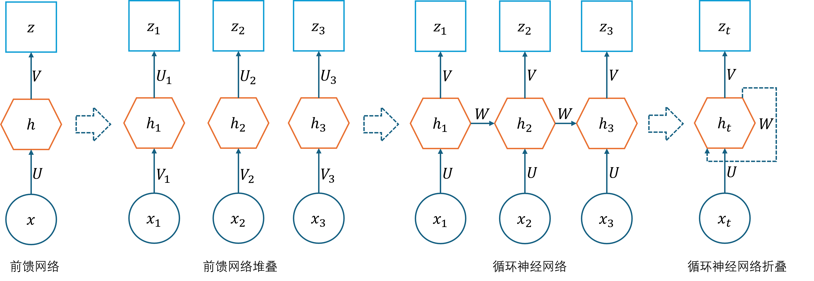
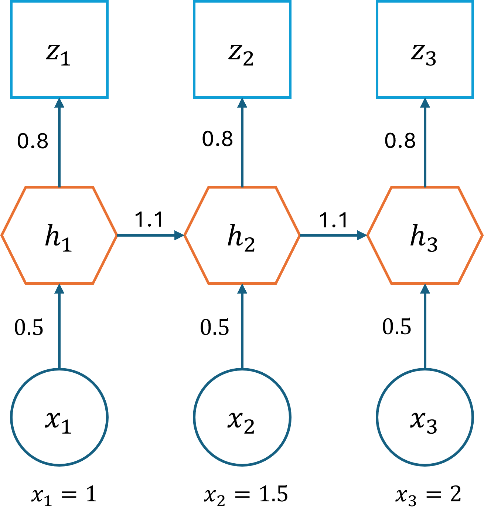
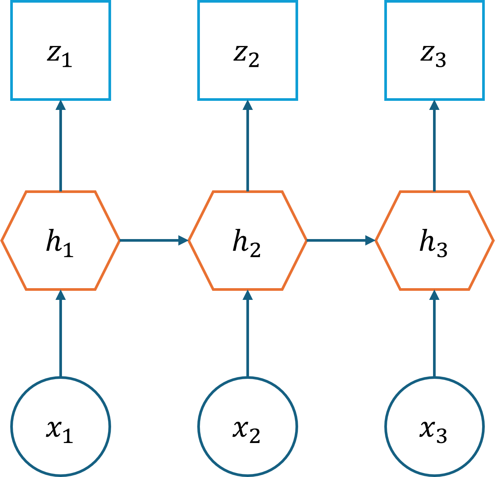
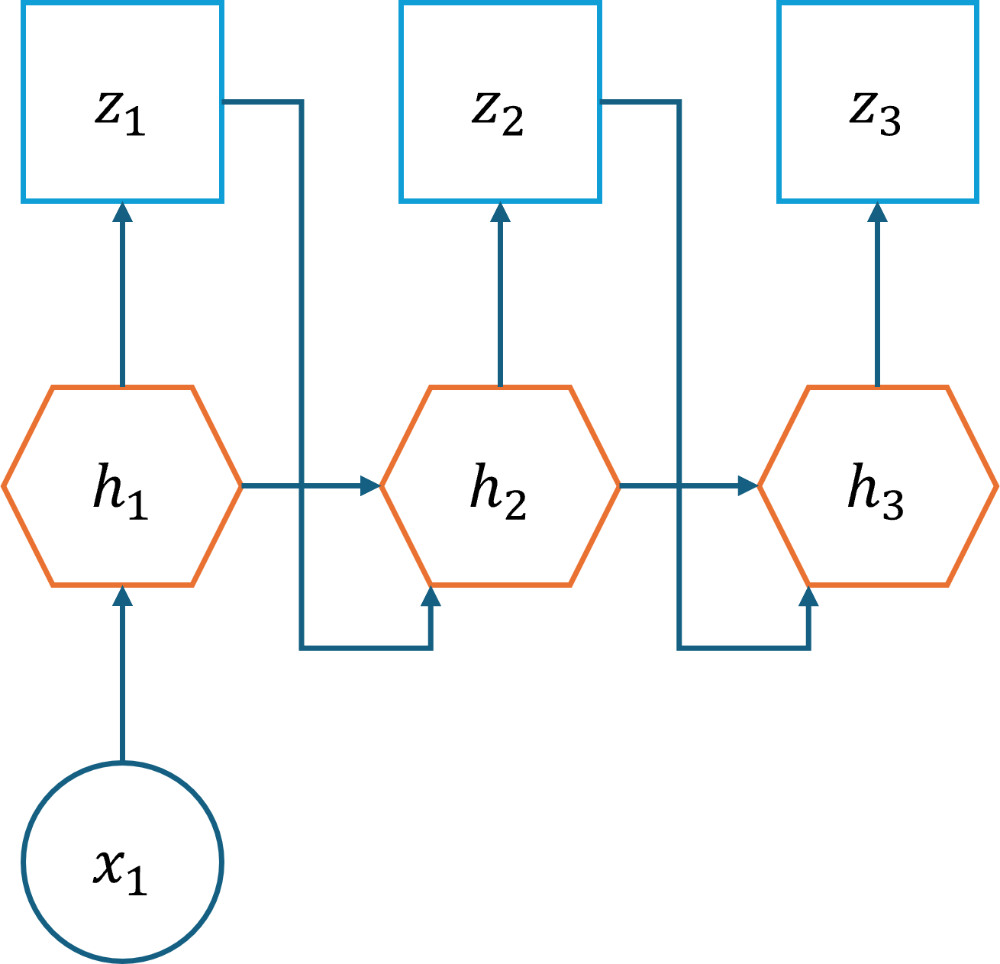
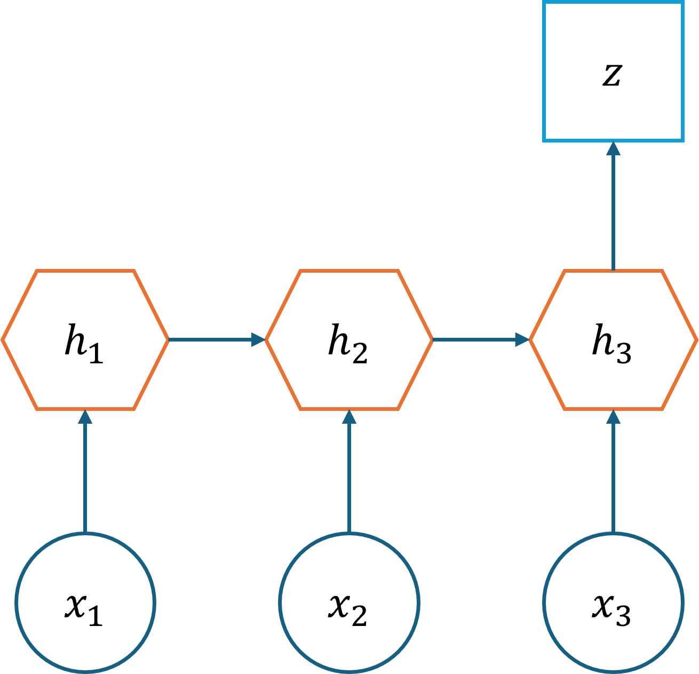
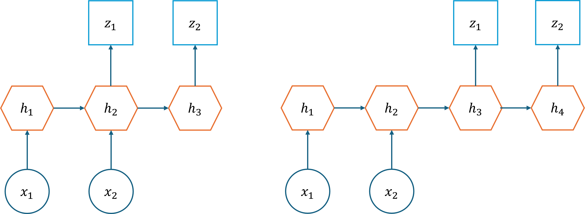

## 1.1 与序列相关的数据问题

通过学习前面的章节，读者可以发现所有的神经网络的输入都是一个或者一批静态的数据，比如一个人的身高、体重、年龄、性别等组成的特征值用于表示一个人当前的属性，这些属性是采样时获得的，并且会保持相对稳定，可以用这些属性通过前馈神经网络来预测一个人的健康状况。而另外一条数据则是另外一个人的特征值，与前一个人丝毫不相关。

再比如输入一张青蛙的图片，通过卷积神经网络来判断图片中的物体的类别，而需要分类的下一张图片可能会是另外一只青蛙的图片，或者是一张汽车的图片，与前面的图片毫不相干。

表 1.1.1 对比说明了以上两种情况。

表 1.1.1 统计与预测的区别

|任务|统计（内插法）|预测（外推法）|
|-|-|-|
|人|在某个时刻统计不同的人的身高、体重、年龄、性别，用于**估计**全体人类的健康状况|在某个时间段内记录同一个人的身高、体重、年龄、性别，用于**预测**个体以后的健康状况|
|青蛙|拍摄很多种/只青蛙的图片进行分析，用于**识别**给出的图片上是哪一种青蛙|拍摄一只青蛙的活动视频进行分析，用于**预判**它的下一个动作或者行动方向|

从上面两个例子中可以看到，对于与时间相关的数据，到目前为止并没有一个很好的解决方案，这就是引入**循环神经网络**（Recurrent Neural Network，RNN）的意义。在前面的学习的回归、分类等任务，都属于对静态数据的统计，从而可以使用内插法来**估计**数值、**识别**分类，而 RNN 是对动态的序列数据进行学习，找到其随时间发展的规律，是一种真正意义上的预测。

在本章中将会研究前后相关的序列数据问题。

### 1.1.1 循环神经网络的发展简史

循环神经网络的历史可以简单概括如下。

- 1933年，西班牙神经生物学家 Rafael Lorente de Nó 发现大脑皮层的解剖结构允许刺激在神经回路中循环传递，并由此提出反响回路假设。
- 1982年，美国学者 John Hopfield 使用二元节点建立了具有结合存储能力的神经网络，即 Hopfield 神经网络。
- 1986年，Michael I. Jordan 基于 Hopfield 网络的结合存储概念，在分布式并行处理理论下建立了新的循环神经网络，即**Jordan网络，把上一个时间步的总输出作为下一个时间步的输入**。
- 1990年，Jeffrey Elman 提出了第一个全连接的循环神经网络，**Elman网络，把上一个时间步的隐层输出作为下一个时间步的输入**。Jordan 网络和 Elman 网络是最早出现的面向序列数据的循环神经网络，由于二者都从单层前馈神经网络出发构建递归连接，因此也被称为简单循环网络（Simple Recurrent Network, SRN）。
- 1990年，Paul Werbos 提出了循环神经网络的随时间反向传播被沿用至今，是循环神经网络进行学习的主要方法。
- 1991年，Sepp Hochreiter 发现了循环神经网络的长期依赖问题，大量优化理论得到引入并衍生出许多改进算法，包括神经历史压缩器、长短期记忆网络、门控循环单元网络、回声状态网络、独立循环神经网络等。

图 1.1.1 简单描述了从前馈神经网络到循环神经网络的演化过程。

图 1.1.1 从前馈神经网络到循环神经网络的演化

以下是演化说明。

- 最左侧的是前馈神经网络的概括图，即，根据一个静态的输入数据 $x$，经过隐层 $h$ 的计算，最终得到结果 $z$。这里的 $h$ 是全连接神经网络或者卷积神经网络，$z$ 是回归或分类的结果。

- 当遇到序列数据的问题后（假设时间步数为3），可以建立三个前馈神经网络来分别处理 $t=1、t=2、t=3$ 的数据，即 $x_1、x_2、x_3$，因为它们有各自不同的权重矩阵 $U、V$，所以得到独立的输出 $z_1、z_2、z_3$。

- 但是时间步之间是有联系的，于是在隐层 $h_1、h_2、h_3$ 之间建立了一条连接线，实际上是用一个连接矩阵 $\mathbf W$ 做乘法。如果仅此而已的话，还不能称之为循环神经网络，只能说是多个前馈神经网络的堆叠而已，而且会有巨大的参数量。可以看到图 1.1.1 第三张子图中所有矩阵 $\mathbf U、\mathbf V、\mathbf W$ 都没有下标，说明它们是同一个矩阵，即**权值共享**，这与卷积网络中的概念相同，所以这里的 $\mathbf W$ 相当于卷积网络的过滤器，$x_t$ 相当于步长为 1 的卷积操作，区别是 RNN 需要把 $t$ 时刻的计算结果输入到 $t+1$ 时刻，而 CNN 不需要。也就是说，如果没有 $\mathbf W$ 的存在，那么 RNN 就相当于一维的 CNN。

- 这样的话，无论有多少个时间步，整个结构图都可以像折扇一样“折叠”起来，用一个“循环”来计算各个时间步的输出，这才是“循环神经网络”的真正含义，如最右侧子图。请注意隐层 $h_t$ 可能是带有激活函数的，所以笔者特意把表示 $\mathbf W$ 的连线绘制为从 $h_t$ 的右上（输出）到左下（输入）。

### 1.1.2 简单的 RNN 计算举例

下面以三个时间步为例说明 RNN 的前向计算方法，如图 1.1.2 所示。

图 1.1.2 简单的 RNN 前向计算

首先看输入部分：$x_1=1，x_2=1.5，x_3=2$，**这是一个样本的三个时间步，而不是三个样本**。每个时间步中的数据只有一个字段（特征），在复杂任务中会有多个特征，比如某一天的天气的温度、湿度、气压等等。

然后看这个简单的 RNN 的结构，由输入层 $x$、隐层 $h$、输出层 $z$ 组成，其中隐层是不带激活函数的，而复杂任务中是需要有激活函数的。为了简化起见，我们在此设置权重部分为一个标量，$U=0.5，V=0.8，W=1.1$，在三个时间步是相同的，因为它们其实是一个权重变量在不同时间步中共享。

计算过程如下。

- 时间步 1：

$$
\begin{aligned}
h_1 &= x_1 U=1 \times 0.5=0.5 \\
z_1 &= h_1 V = 0.5 \times 0.8 = 0.4
\end{aligned}
$$

- 时间步 2：

$$
\begin{aligned}
h_2 &= x_2 U + h_1 W=1.5 \times 0.5+0.5 \times 1.1= 1.3\\
z_2 &= h_2 V = 1.3 \times 0.8 = 1.04
\end{aligned}
$$

- 时间步 3：

$$
\begin{aligned}
h_3 &= x_3 U + h_2 W=2 \times 0.5 + 1.3 \times 1.1 = 2.43\\
z_3 &= h_3 V = 2.43 \times 0.8 = 1.944
\end{aligned}
$$

所以最后的输出为 $z_1=0.4，z_2=1.04，z_3=1.944$。

在有些应用中，可能只需要最后的 $z_3$ 作为输出，而不需要计算 $z_1、z_2$，这样的话，在计算反向传播时，就不需要计算 $z_1、z_2$ 的损失函数（loss）值，所有梯度都从 $z_3$ 返回。而在另外一些应用中，有可能把 $z_1$ 而不是 $h_1$ 作为 $h_2$ 的输入，同理 $z_2$ 作为 $h_3$ 的输出，此时计算回传梯度时将会更加复杂。这些情况会在后面的章节中讨论。

从上述计算过程可以体会到，时间步 1 的特征值 $x_1$ 通过 $W$ 的连接被传向了后面的时间步计算中，所以 $z_2、z_3$ 的结果中实际上也有 $x_1$ 的贡献。而 $W$ 的值固定为 1.1，意为对过去的时间步的特征的重视程度，值越大的话越依赖于过去，值越小越倾向于重视当前值。

### 1.1.3 根据输入输出划分种类

#### 1. 一对一

一对一结构要求输入数据的时间步和输出数据的时间步的数量相同，如图 1.1.3 所示。

图 1.1.3 循环神经网络一对一输出结构

比如想分析一个有 100 帧的视频中每一帧的分类，则输入 100 帧，输出是对应的 100 个分类结果。

#### 2. 一对多

举两个例子。

- 用户可以指定一个风格或者一段旋律，让机器自动生成一段具有巴赫风格的乐曲。
- 在中国，有藏头诗的文字形式，比如以“春”字开头的一句五言绝句可以是“春眠不觉晓”、“春草细还生”等等。

上面这两个例子都是只给出一个输入，生成多个输出的情况，如图 1.1.4 所示。

图 1.1.4 循环神经网络一对多输出结构

这种情况的特殊性在于，第一个时间步生成的结果要做为第二个时间步的输入，使得前后有连贯性。图中只画出了 3 个时间步，在实际的应用中，如果是五言绝句，则有 5 个时间步；如果是音乐生成任务，需要指定小节数，比如 40 个小节，则时间步为 40。

#### 3. 多对一

在阅读一段影评后，会判断出该观众对所评价的电影的基本印象如何，比如是积极的评价还是消极的评价，反映在数值上就是给 5 颗星还是只给 1 颗星。在这个例子中，输入是一段话，可以拆成很多句或者很多词组，输出则是一个分类结果。这是多输入单输出的形式，如图 1.1.5 所示。

图 1.1.5 循环神经网络多对一输出结构

图中 $x$ 可以看作很多连续的词依次输入到网络中，只在最后一个时间步才有一个统一的输出。另外一种典型的应用就是视频动作识别，输入连续的视频帧（图片形式），输出是分类结果，比如“跑步”、“骑车”等等动作。

还有一个很吸引人的应用就是股票价格的预测，输入是前10天的股票基本数据，如每天的开盘价、收盘价、交易量等，而输出是明天的股票的收盘价，这也是典型的多对一的应用。

#### 4. 多对多

这是循环神经网络最重要的一个变种，如图 1.1.6 所示。

图 1.1.6 循环神经网络多对多输出结构

图 1.1.6 左图是一个典型应用：基于字符的语言模型。比如对于英文单词“cat”来说，当输入“c”时，计算输出第二个字母“a”的概率；输入是“a”时，计算输出第三个字母“t”的概率。

图 1.1.6 右图以机器翻译任务举例，源语言和目标语言的句子通常不会是相同的长度，为此，此种结构会先把输入数据编码成一个上下文向量，在 $h_2$ 后生成，做为 $h_3$ 的输入。此时，$h_1$ 和 $h_2$ 可以看做是一个编码网络，$h_3$ 和 $h_4$ 看做是一个解码网络。解码网络拿到编码网络的输出后，进行解码，得到目标语言的句子。

由于这种结构不限制输入和输出的序列长度，所以应用范围广泛，类似的应用还有：

- 文本摘要，输入是一段文本，输出是摘要，摘要的字数要比正文少很多；

- 阅读理解，输入是文章和问题，输出是问题答案，答案一般都很简短；

- 语音识别，输入是语音信号序列，输出是文字序列，输入的语音信号按时间计算长度，而输出按字数计算长度，根本不是一个量纲。
