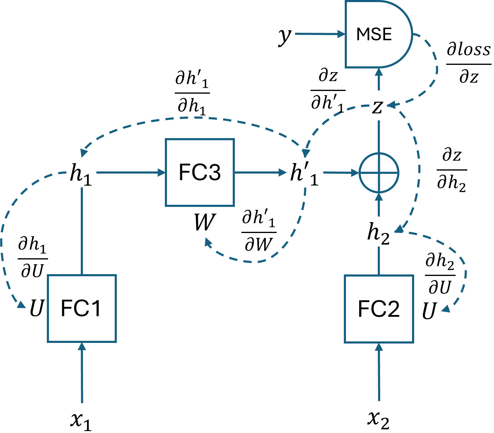
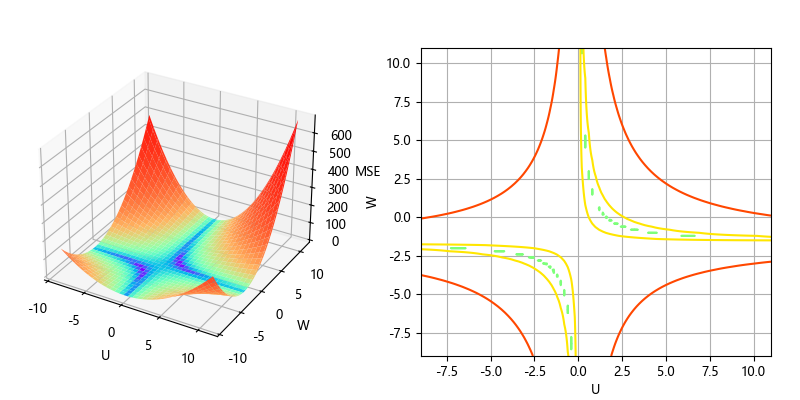

## 1.2 两个时间步的循环神经网络

我们先用一个最简单的序列问题来了解一下循环神经网络的基本运作方式。

斐波那契数列（Fibonacci sequence），又称黄金分割数列，因数学家莱昂纳多·斐波那契（Leonardo Fibonacci）以兔子繁殖为例子而引入，故又称“兔子数列”，其数值为：0、1、1、2、3、5、8、13、21、34... 在数学上，这一数列以如下递推的方法定义：

$$
\begin{aligned}
f_0&=0 \\  f_1&=1 \\
f_n&=f_{n-1}+f_{n-2} \ \ (n ≥ 2，n \in N)
\end{aligned}
\tag{1.2.1}
$$

由于：

$$
\lim_{n \to \infty}\frac{f_n}{f_{{n+1}}}=\lim_{n \to \infty}\frac{f_{n+1}}{f_{{n+2}}}=a
\tag{1.2.2}
$$

所以：

$$
\frac{1}{a}=\lim_{n \to \infty}\frac{f_{n+2}}{f_{{n+1}}}=\lim_{n \to \infty}\frac{f_n+f_{n+1}}{f_{{n+1}}}=\lim_{n \to \infty}\frac{f_n}{f_{{n+1}}}+\lim_{n \to \infty}\frac{f_{n+1}}{f_{{n+1}}}=a+1
$$

得到：

$$
a = \frac{\sqrt{5}-1}{2}\approx 0.618
$$

所以其极限是黄金分割比例，比如当 $n=23$ 时，$28657/46368 \approx 0.618$。

我们的问题是：**如何使用神经网络来表达斐波那契数列的规律**？

### 1.2.1 用普通前馈神经网络解决问题

### 1.2.2 用最简单的 RNN 解决问题

#### 1. 神经网络结构

图 1.2.1 两个时间步的前馈神经网络

#### 2. 前向计算

#### 3. 反向传播

#### 4. 训练与预测

### 1.2.3 损失函数

图 1.2.2 关于参数 U,W 的损失函数形态
