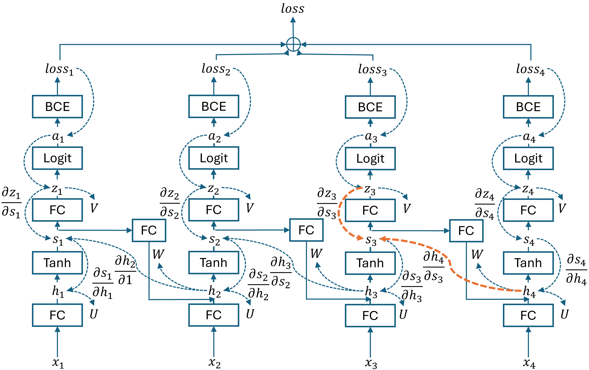
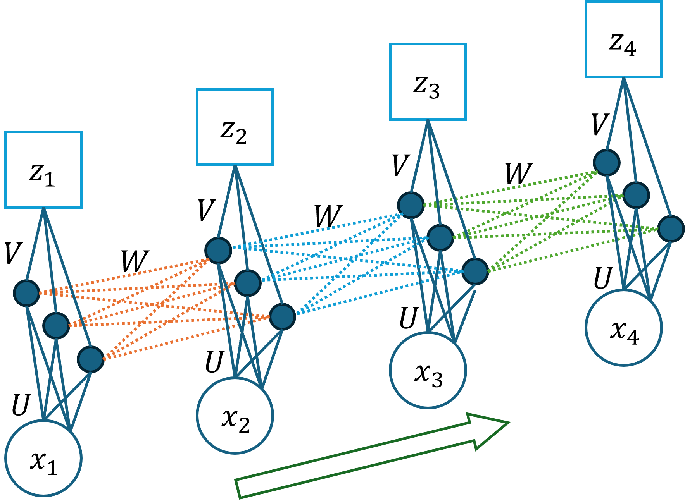
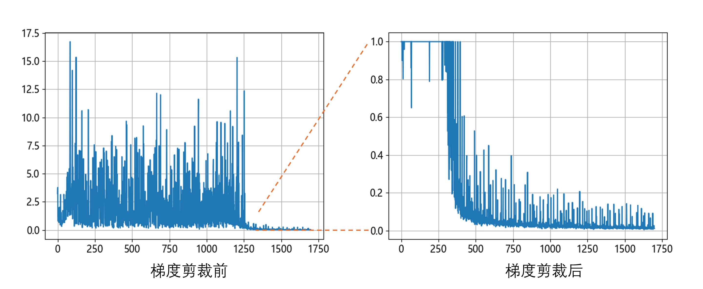
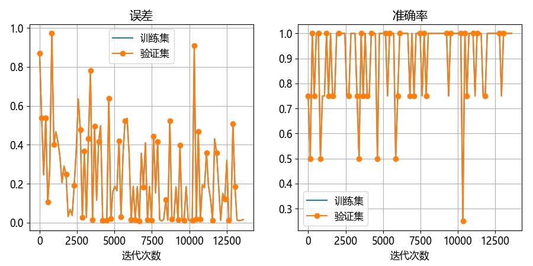
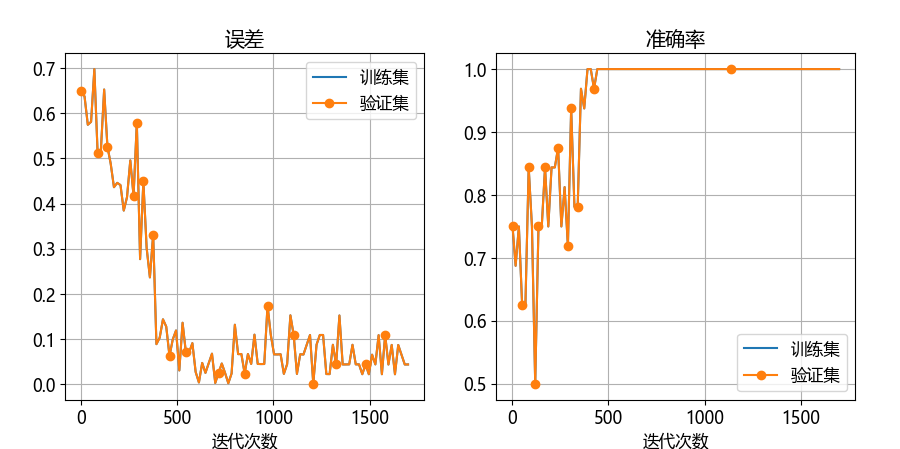

## 1.3 四个时间步的循环神经网络

### 1.3.2 使用线性网络解决十进制减法问题

### 1.3.3 使用 RNN 解决二进制减法问题

图 1.3.1 四个时间步的二进制减法 RNN 网络

#### 1. 前向计算

图 1.3.2 RNN 参数展开图

#### 2. 求反向传播的梯度

#### 3. 求 $\mathbf{U}, \mathbf{V},\mathbf{W}$ 参数梯度

### 1.3.4 代码实现

### 1.3.5 网络训练

图 1.3.3 矩阵 $\mathbf W$ 的梯度的范数随着训练轮数变化的情况

图 1.3.4 当梯度不稳定时的训练误差和准确率的变化

图 1.3.5 梯度剪裁后的训练误差和准确率的变化

### 1.3.6 结果解释

### 1.3.7 延展测试

