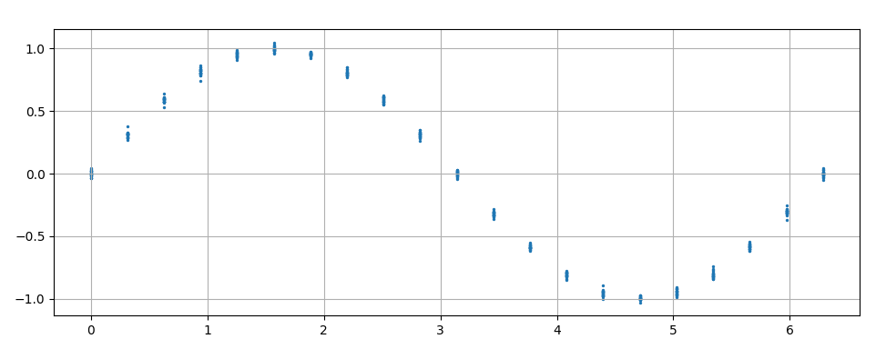
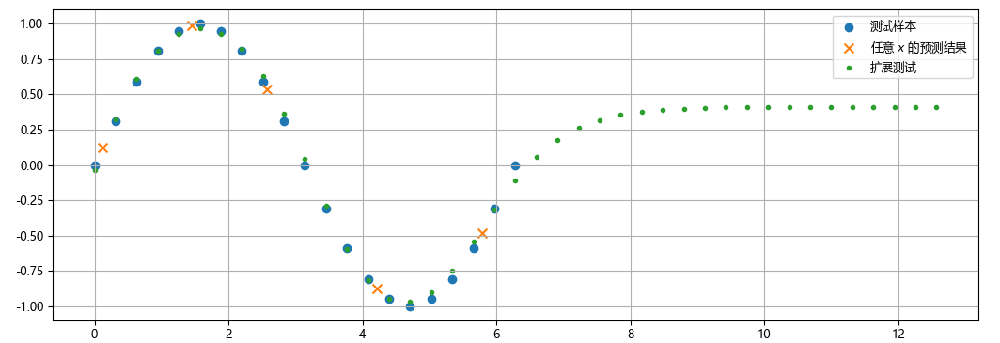
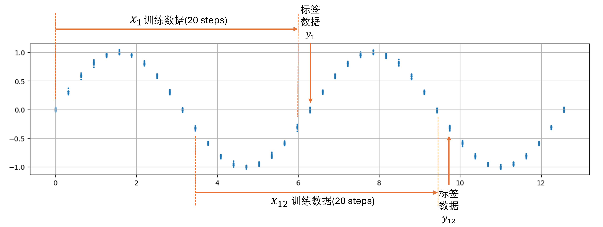
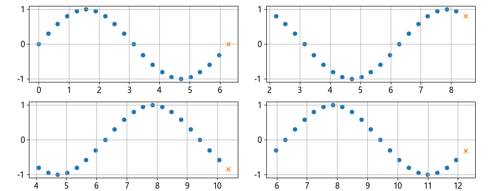
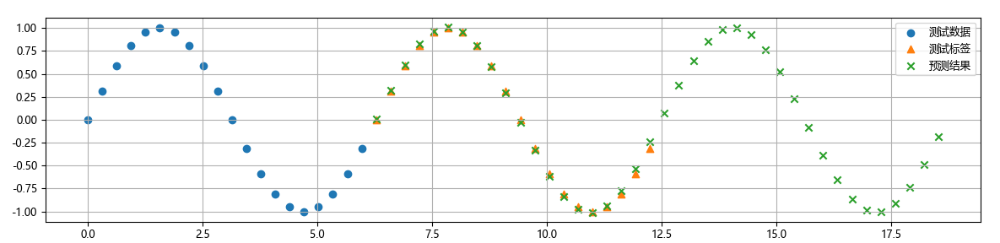
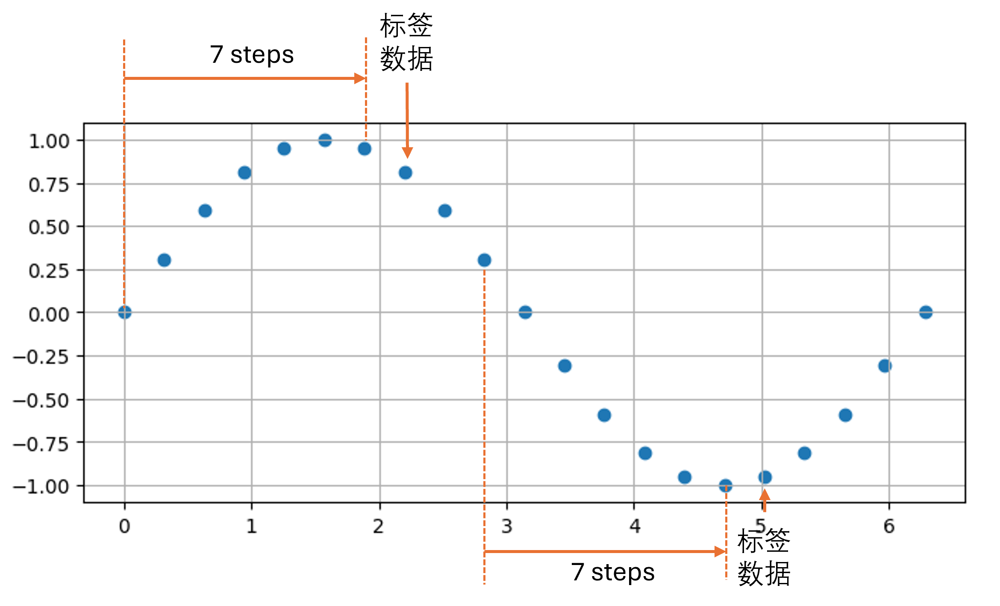
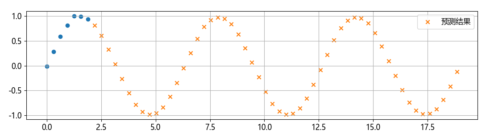
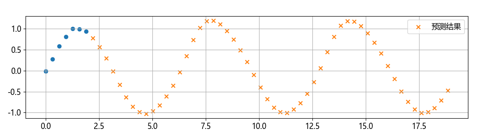
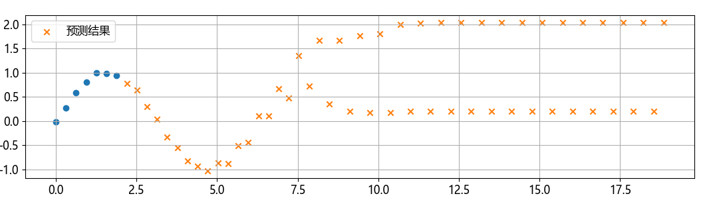

## 1.5 周期性序列预测

### 1.5.1 用普通前馈神经网络预测

图 1.5.1 正弦曲线的样本数据

图 1.5.2 前馈神经网络对正弦曲线的测试结果

### 1.5.2 用 RNN 预测

图 1.5.3 用 RNN 预测正弦曲线所需要的样本数据（20个时间步）

### 1.5.3 训练结果

图 1.5.4 四个测试样本

图 1.5.5 预测超出训练样本范围的正弦曲线区间 $[4\pi,6\pi]$

### 1.5.4 更多试验

图 1.5.6 用 RNN 预测正弦曲线所需要的样本数据（7个时间步）

图 1.5.7 正确的预测结果

图 1.5.8 有偏差的预测结果

图 1.5.9 完全错误的预测结果
