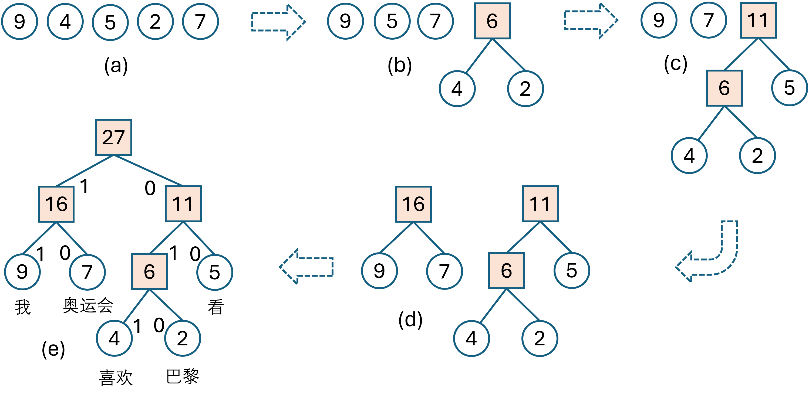
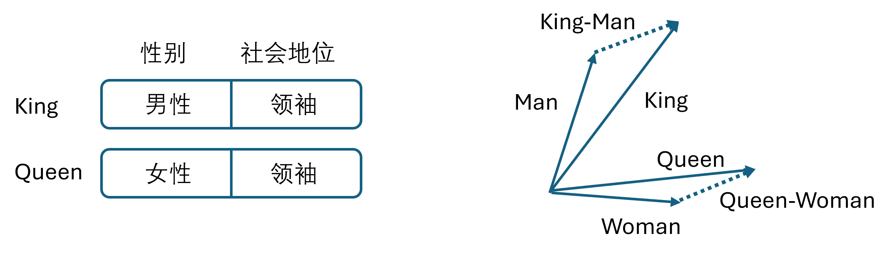
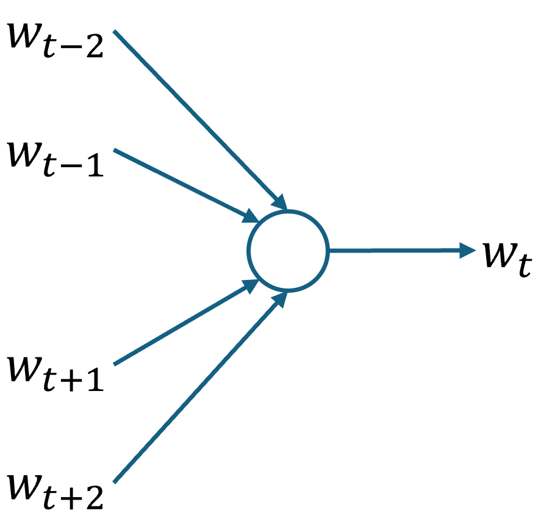
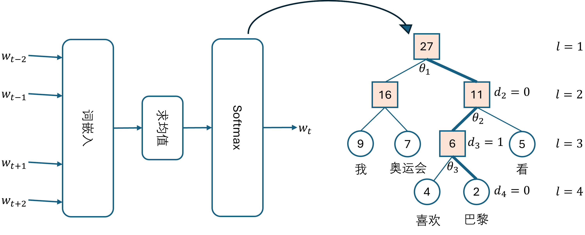
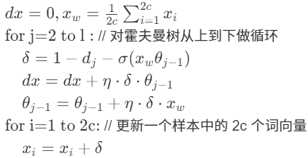
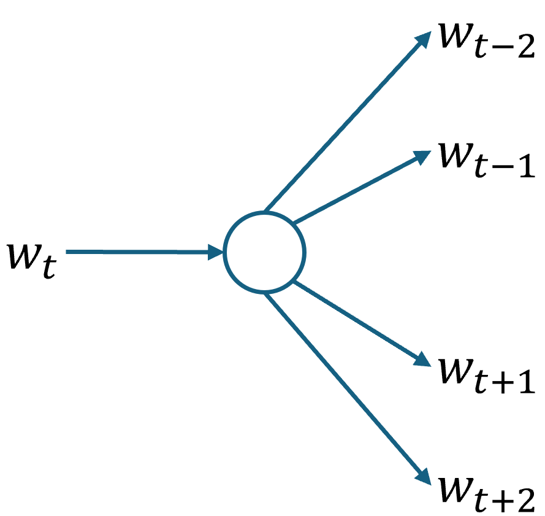
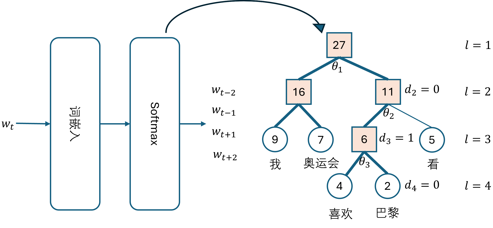

## 2.4 分布式表示与词嵌入

### 2.4.1 霍夫曼编码

图 2.1.1 霍夫曼编码过程

### 2.4.2 分布式表示

### 2.4.3 词嵌入

图 2.4.2 King 和 Queen 的词向量示意图

### 2.4.4 连续词袋模型

图 2.4.3 连续词袋模型的基本思想

图 2.4.4 连续词袋模型结构

### 2.4.5 连续跳元模型

图 2.4.5 连续跳元模型的基本思想

图 2.4.6 连续跳元模型结构

### 2.4.6 负采样

使