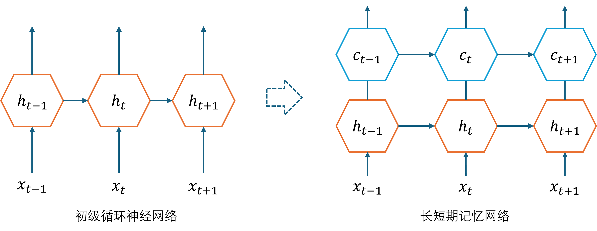
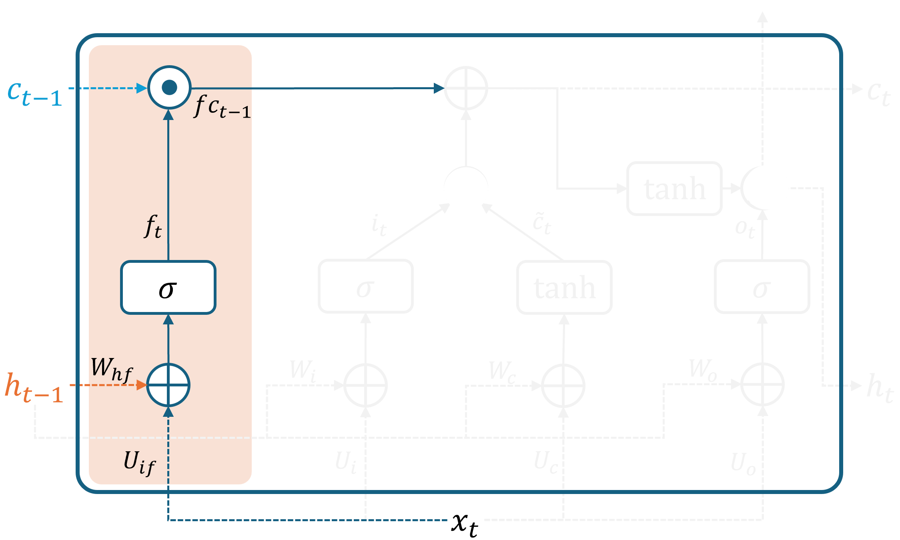
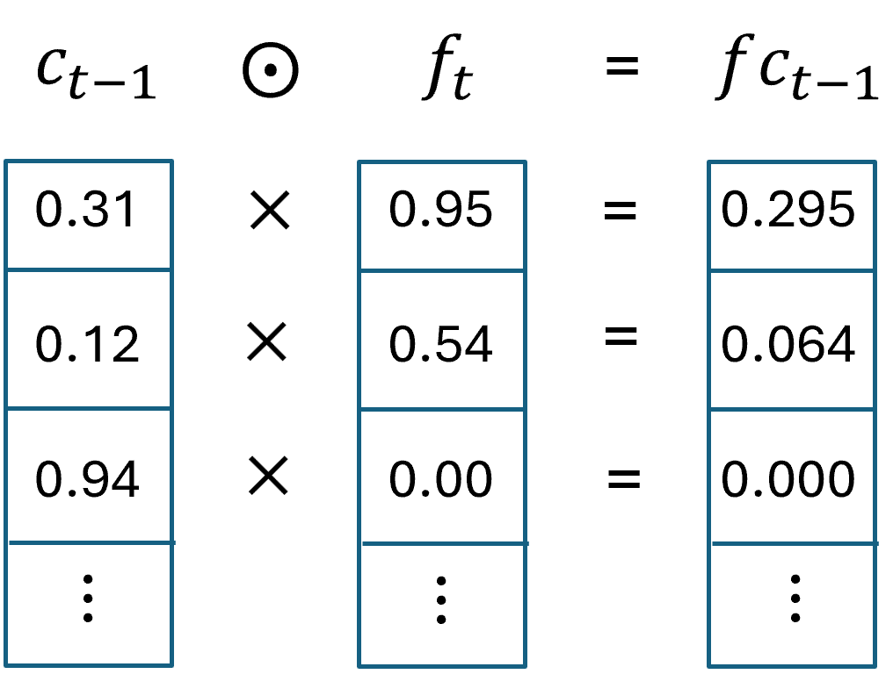
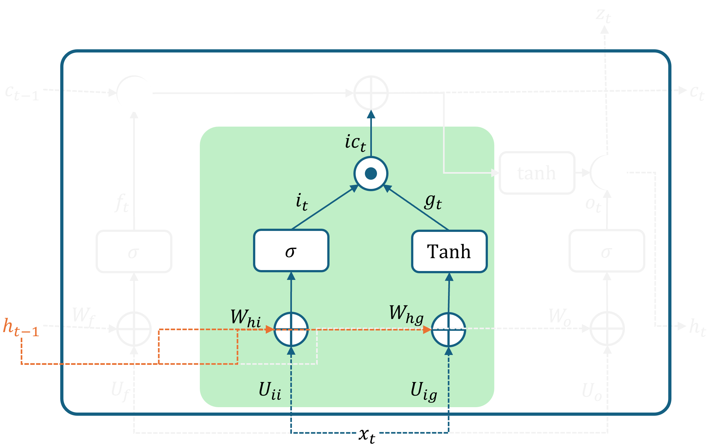
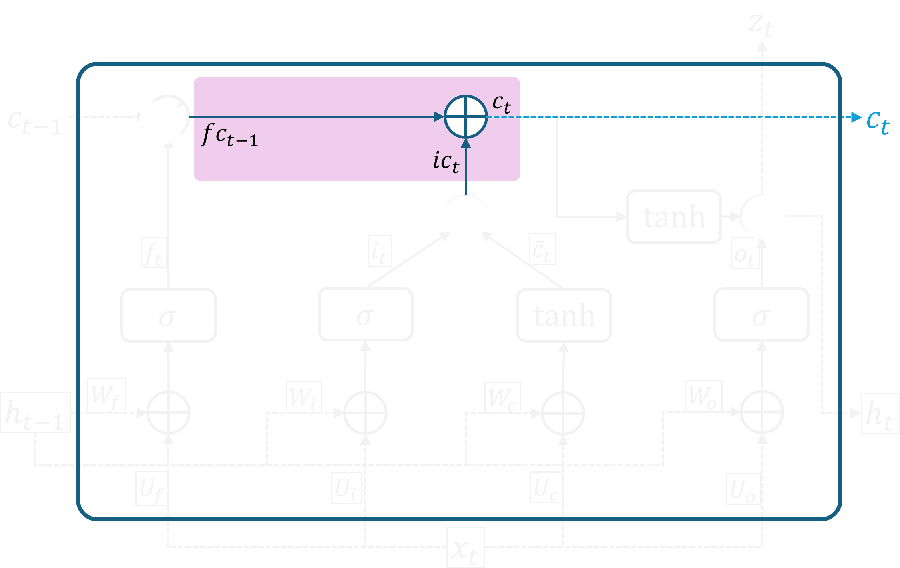
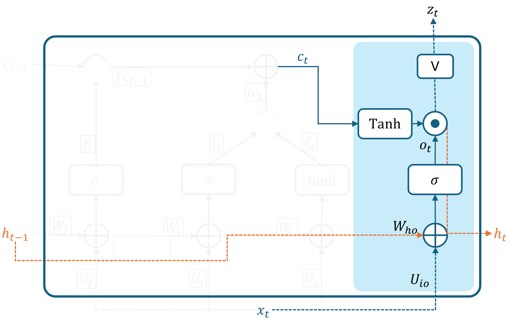
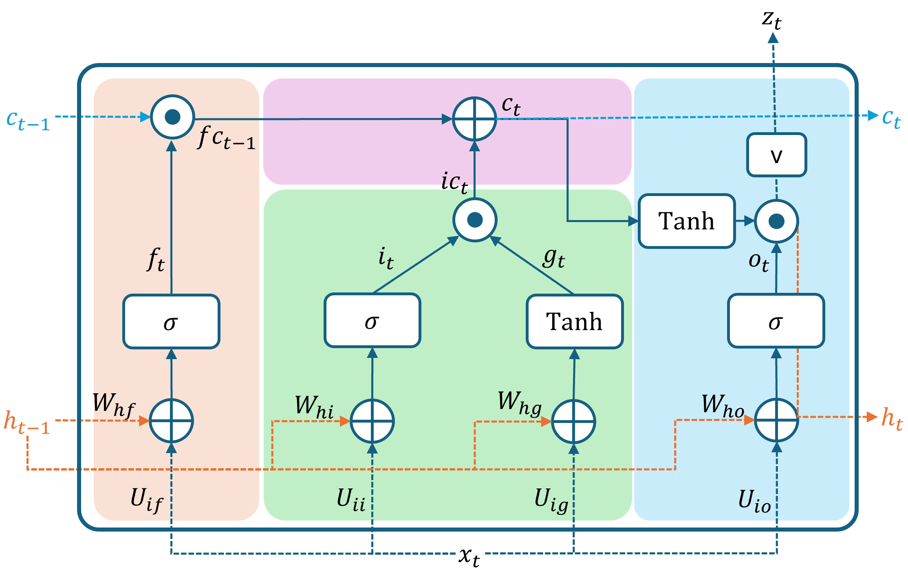

## 2.8 长短期记忆网络

### 2.8.1 长短期记忆单元

图 2.8.1 从初级循环神经网络到长短期记忆网络

### 2.8.2 结构说明

图 2.8.2 LSTM中的遗忘门

图 2.8.3 门控机制工作过程

图 2.8.4 LSTM中的输入门

图 2.8.5 LSTM中的记忆单元

图 2.8.6 LSTM中的输出门

图 2.8.7 完整的 LSTM 单元结构

### 2.8.3 实例计算

图 2.8.8 LSTM 计算实例

图 2.8.9 更新梯度后得到的新参数值

### 2.8.4 为什么 LSTM 可以工作？

