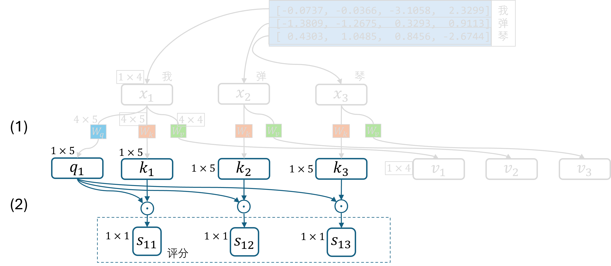

## 3.6 自注意力机制

### 3.6.1 自注意力机制的工作原理

图 3.6.1 自注意力机制工作原理（一）

图 3.6.2 自注意力机制工作原理（二）

图 3.6.3 自注意力机制工作原理（三）

图 3.6.4 自注意力机制工作原理（四）

### 3.6.2 缩放点积自注意力机制

图 3.6.5 缩放点积注意力的计算过程

图 3.6.6 缩放自注意力机制运算过程

图 3.6.7 自注意力矩阵的含义

