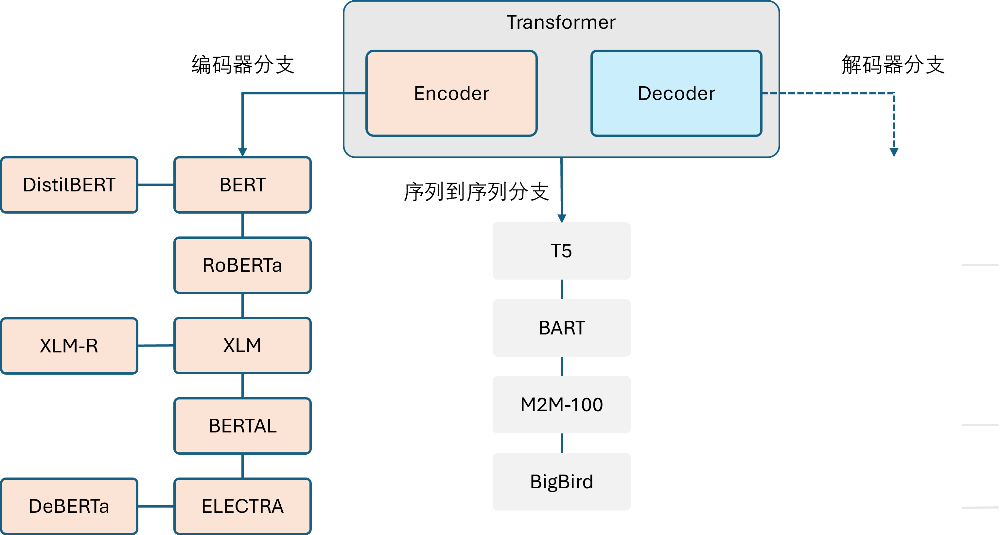

## 5.1 编码器模型家族

在 Transformer 出现后，大家惊叹于这种架构对于序列数据的并行处理能力，纷纷投入时间进行研究。有些研究人员认为，只有编码器结构以及可以很好地处理一些 NLP 问题了，而加入解码器之后会让事情变得复杂和不可控。于是，出现了一批只使用 Transformer 架构中的编码器部分的模型，见图 5.1.1。

图 5.1.1 编码器模型家族

接下来，我们简要介绍编码器分支中的典型代表。

### 编码器分支

编码器模型只使用 Transformer 模型中的编码器模块，也被称为自编码（auto-encoding）模型。在每个阶段，注意力层都可以访问到原始输入句子中的所有词语，即具有“双向注意力”。

编码器模型通常通过破坏给定的句子（例如随机遮盖其中的词语），然后让模型进行重构来进行预训练，最适合处理那些需要理解整个句子语义的任务，例如句子分类、命名实体识别（词语分类）、抽取式问答。

BERT 是第一个基于 Transformer 结构的编码器模型，它在提出时横扫了整个 NLP 界，在流行的通用语言理解评估（general language understanding evaluation，GLUE）基准上超过了当时所有的最强模型。随后的一系列工作对 BERT 的预训练目标和架构进行调整以进一步提高性能。目前，编码器模型依然在 NLP 行业中占据主导地位。

下面简略介绍一下 BERT 模型及它的常见变体。

- BERT：通过两个任务来进行预训练，前一个任务被称为掩码语言建模（masked language modeling, MLM），后一个任务被称为下句预测（next sentence prediction, NSP）。

- DistilBERT：尽管 BERT 性能优异，但它的模型大小使其难以部署在低延迟需求的环境中。通过在预训练期间使用知识蒸馏（knowledge distillation）技术，DistilBERT 在内存占用减少 40%、计算速度提高 60% 的情况下，依然可以保持 97% 的性能。

- RoBERTa：BERT 之后的一项研究表明，通过修改预训练方案可以进一步提高性能。RoBERTa 在更多的训练数据上，以更大的批次训练了更长的时间，并且放弃了 NSP 任务。与 BERT 模型相比，这些改变显著地提高了模型的性能。

- XLM：跨语言语言模型（cross lingual language model，XLM）探索了构建多语言模型的多个预训练目标，包括来自 GPT 的自回归语言建模和来自 BERT 的 MLM，还将 MLM 拓展到多语言输入，提出了翻译语言建模（translation language modeling, TLM）。XLM 在多个多语言 NLU 基准和翻译任务上都取得了最好的性能。

- XLM-RoBERTa：跟随 XLM 和 RoBERTa，XLM-RoBERTa（XLM-R）通过升级训练数据来改进多语言预训练。其基于 Common Crawl 创建了一个 2.5 TB 的语料，然后运用 MLM 训练编码器，由于没有平行对照文本，因此移除了 XLM 的 TLM 目标。最终，该模型大幅超越了 XLM 和多语言 BERT 变体。

- ALBERT：ALBERT 通过三处变化使得编码器架构更高效。首先将词嵌入维度与隐藏维度解耦以减少模型参数；其次所有模型层共享参数；最后将 NSP 任务替换为句子排序预测（判断句子顺序是否被交换）。这些变化使得可以用更少的参数训练更大的模型，并在自然语言理解（natual language understanding，NLU）任务上取得了优异的性能。

- ELECTRA：MLM 在每个训练步骤中只有被遮盖掉词语的表示会得到更新，ELECTRA 使用了一种双模型方法来解决这个问题。第一个模型继续按标准 MLM 工作；第二个模型（鉴别器）则预测第一个模型的输出中哪些词语是被遮盖的，这使得训练效率提高了 30 倍。下游任务使用时，鉴别器也参与微调。

- DeBERTa：DeBERTa 模型引入了两处架构变化。首先将词语的内容与相对位置分离，使得自注意力层可以更好地建模邻近词语对的依赖关系；此外在解码头的 Softmax 层之前添加了绝对位置嵌入。DeBERTa 是第一个在 SuperGLUE 基准上击败人类的模型。

在本章的其余部分将详细介绍 BERT 模型。
