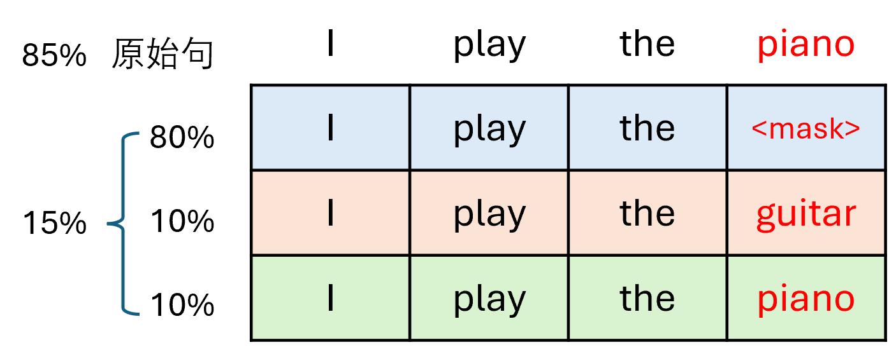

## 5.3 BERT 预训练任务

图 5.3.1 BERT 的预训练任务

### 5.3.1 数据预处理

### 5.3.2 预测下一句任务

图 5.3.2 BERT 的预训练任务 NSP

### 5.3.3 掩码语言模型任务

图 5.3.3 掩码语言模型的掩码策略

图 5.3.4 掩码语言模型任务

图 5.3.5 MLM 中的 index_select 操作

图 5.3.6 loss 值的后处理

### 5.3.4 预训练模型

### 5.3.5 测试模型

图 5.3.7 “bank”在不同上下文中的词向量余弦相似度值对比

### 5.3.6 BERT 为什么可以工作？
