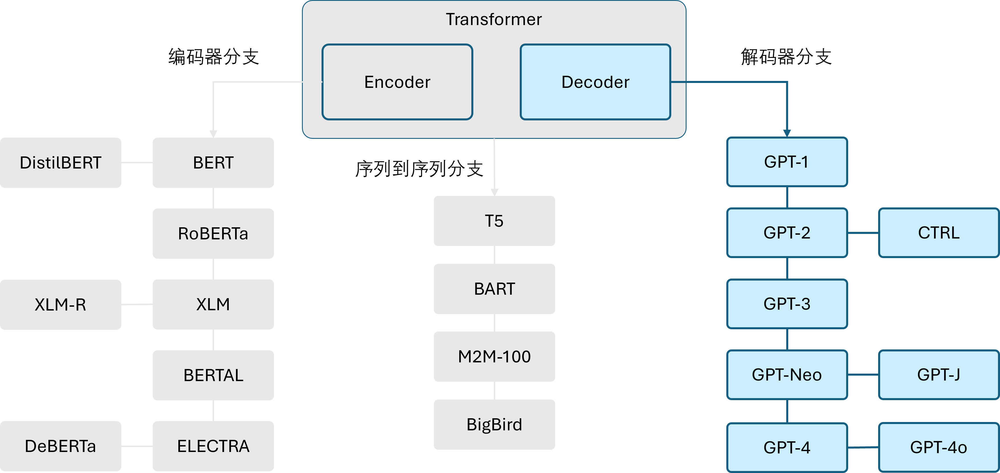
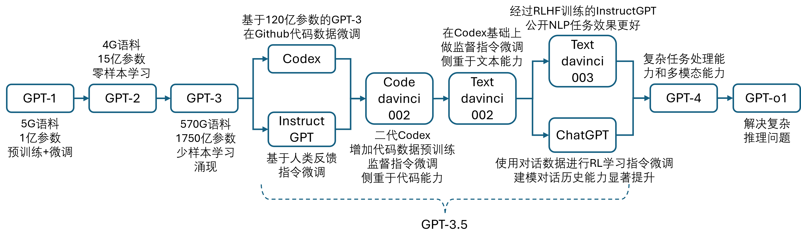

## 6.1 解码器模型家族

在第 4 章中，我们曾介绍过 Transformers 模型家族，并把它们按照架构分成了三个分支：编码器分支、解码器分支、序列到序列分支；在第 5 章中，我们介绍了编码器分支的代表 BERT；在本章中，我们将介绍解码器分支的代表 GPT（generative pre-trained Transformer）。如图 6.1.1 所示。

图 6.1.1 Transformers 模型家族中的解码器分支

### 6.1.1 解码器分支

只有解码器（decoder-only）的模型只使用 Transformer 模型中的解码器模块。在每个阶段，对于给定的词语，注意力层只能访问句子中位于它之前的词语，即只能迭代地基于已经生成的词语来逐个预测后面的词语，因此也被称为自回归（auto-regressive）模型。由于解码器模型的预训练通常围绕着预测句子中下一个单词展开，所以适合那些涉及文本生成的任务。

对 decoder-only 模型的探索在很大程度上是由 OpenAI 带头进行的，通过使用更大的数据集进行预训练，以及将模型的规模扩大，解码器模型的性能也在不断提高。OpenAI 推出的一系列模型都被称作 GPT，下面就简要介绍一些常见的生成模型。

- GPT-1：结合了 Transformer decoder 架构和迁移学习，通过根据上文预测下一个单词的预训练任务，在 BookCorpus 数据集上进行了预训练。GPT 模型在分类等下游任务上取得了很好的效果。

- GPT-2：受简单且可扩展的预训练方法的启发，OpenAI 通过扩大原始模型和训练集创造了 GPT-2，它能够生成篇幅较长且语义连贯的文本。

- CTRL：GPT-2 虽然可以根据提示模板续写文本，但是几乎无法控制生成序列的风格。条件 Transformer 语言模型（conditional Transformer language, CTRL）通过在序列开头添加特殊的“控制符”以控制生成文本的风格，这样只需要调整控制符就可以生成多样化的文本。

- GPT-3：将 GPT-2 进一步放大 100 倍，GPT-3 具有 1750 亿个参数。除了能生成令人印象深刻的长篇文字之外，还展示了小样本学习的能力。这个模型目前没有开源。

- GPT-Neo / GPT-J-6B：由于 GPT-3 没有开源，因此一些旨在重新创建和发布 GPT-3 规模模型的研究人员组成了 EleutherAI 公司，训练出了类似 GPT 的 GPT-Neo 和 GPT-J-6B 。当前公布的三个模型分别具有 1.3、2.7、60 亿个参数，在性能上可以媲美较小版本的 GPT-3 模型。

需要说明的是，国内的大模型属于后起之秀，曾经在三个月内诞生了 79 个大模型，其中比较有名的有文心一言、通义千问、混元助手、盘古、豆包、百川、智谱等等，都是性能很好的模型。本书中以 OpenAI 的 GPT 系列为主线介绍大模型的基本原理与相关技术，一是因为 OpenAI 起步最早，二是因为大家的技术路线其实都差不多。

### 6.1.2 GPT 系列模型

在图 6.1.2 中给出更多的关于 GPT 系列模型的发展历程。

图 6.1.2 OpenAI 的 GPT 系列发展历程

自从 OpenAI 推出第一代 GPT 模型以来，GPT 系列已经经历了显著的演变，成为自然语言处理领域的技术翘楚。从 GPT-1 的初步实验，到 GPT-2 的规模扩大，再到 GPT-3 的前所未有的复杂性和能力，每一代 GPT 模型都在扩展深度学习技术的边界。GPT 模型的核心技术—Transformer架构，已成为当代 AI 研究的基石，其自注意力机制使得模型能够更有效地处理长序列数据，提供更准确的语言生成和理解能力。

GPT 模型最重要的技术成就之一是其模型能力在预训练和微调（又叫做后训练）策略上得到了大幅度的提升，这种策略使得 GPT 模型在没有特定任务数据后训练的情况下，通过调整少量的顶层参数来适应各种语言处理任务，显示出惊人的灵活性和效率。此外，GPT-3 展示了 AI 在生成可信、连贯和复杂文本方面的潜能，这在自动内容创造、交互式聊天机器人等应用中有着巨大的实用价值。并且，GPT-3 以后的模型甚至不需要微调，而只用少量学习样本在不改变任何模型参数的情况下完成指定任务。

未来的 GPT 模型预计将继续在规模和智能化方面进行突破。随着算力的增强和算法的优化，我们可能会看到更大规模的 GPT 模型，这些模型将提供更深层次的语义理解和更精细的语言生成能力。这不仅会推动人工智能技术的发展，也可能改变人们与机器交互的方式。

从社会和行业的角度看，GPT 技术的进步将带来更高效的工作流程和新的商业模式。例如，自动化的文本生成可以帮助内容创作者快速产出高质量稿件，而高度智能的对话系统可以在教育、客服等领域提供个性化支持。然而，这也带来了对数据隐私、信息安全和伦理使用AI的新挑战，需要业界、政策制定者和社会各界共同努力以确保技术的健康发展。

总之，GPT 模型的发展不仅是技术创新的典范，也是探索人工智能潜能和应对未来挑战的重要窗口。随着技术的不断进步，预期 GPT 模型将在塑造未来社会和经济景观中扮演越来越重要的角色。
