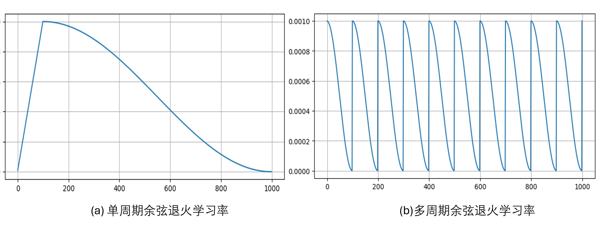
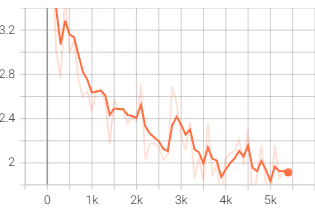
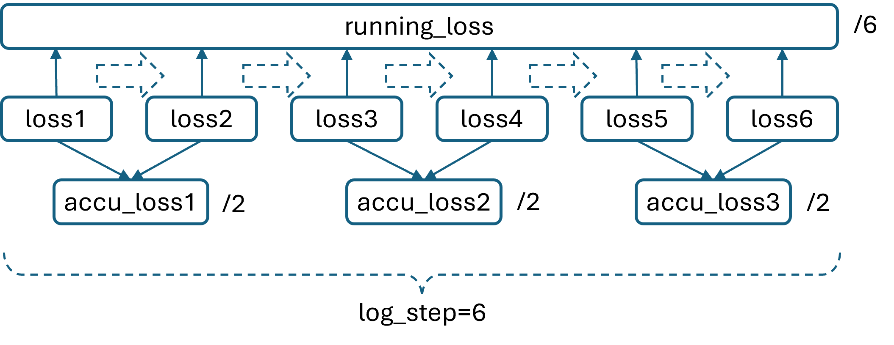

## 6.5 训练对联生成模型

### 6.5.1 数据下载

### 6.5.2 训练分词器

### 6.5.3 数据处理

### 6.5.4 模型

### 6.5.5 计算损失函数值

### 6.5.6 训练

图 6.5.1 训练的热身阶段与退火阶段的学习率变化

图 6.5.2 用 TensorBoard 查看 loss 历史曲线

图 6.5.3 各种 loss 的关系

