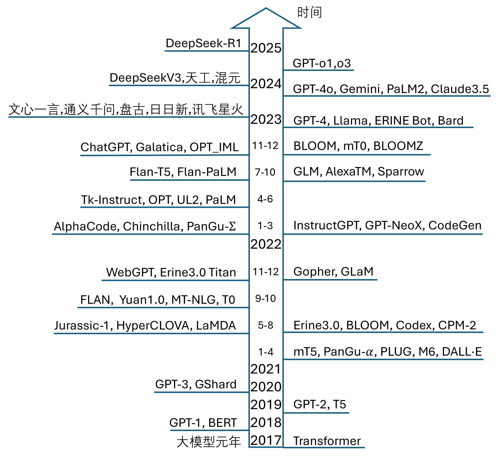

## 7.1 大语言模型概览

BERT 是一个基于 Transformer 架构的编码器模型，其参数量约为 1.1亿。在当时，这个参数量虽然已经相当大，但还不足以被称为大语言模型（large language model，LLM）。OpenAI 推出的 GPT-1 和 GPT-2 属于解码器模型，它们在当时并没有引起太大的关注。谷歌的 T5 模型拥有 110 亿参数量，在那时引起了轰动，其模型性能也相当出色。当然，T5 包含编码器和解码器两部分，因此模型规模较大也是可以理解的。

那么多大的模型可以被称作大模型呢？在继续介绍 GPT 系列模型之前，我们先对已经出现的 LLM 做一个概括性的介绍。

### 7.1.1 大语言模型的定义

大语言模型这个术语并没有一个严格的参数量界定，因为它随着技术的发展和模型规模的增加而不断演变。不过，我们可以从历史和当前的背景中给出一个大致的参考如下。

早期定义：在早期，拥有几百万到几亿参数的模型就被认为是大型模型。这些模型相比于当时的小型模型，能够捕捉更复杂的语言特征和更长的依赖关系。

发展中的界定：随着深度学习和Transformer架构的出现，拥有数十亿参数的模型开始变得常见。例如，BERT-base模型有1.1亿参数，GPT-2模型的参数量从1.2亿到15亿不等。

当前的标准：在当前，通常认为参数量在数千亿的模型可以被称为大语言模型。例如，GPT-3模型的参数量从1750亿到9000亿不等，Switch Transformer模型拥有1.6万亿参数，都是 LLM。与此相比，微软的 Phi-4 有 140 亿参数，被称为小语言模型（small language model，SLM）。

未来的趋势：随着计算资源的增加和训练技术的进步，大语言模型的参数量可能会继续增加。未来的大语言模型可能会拥有数万亿甚至更多的参数。

总的来说，一个模型是否被称为大语言模型，不仅取决于其参数量，还取决于其在当时技术背景下的相对规模和能力。随着时间的推移，这个标准也在不断变化。

### 7.1.2 大语言模型的发展

Transformer 架构是 2017 年提出的，虽然之后过了3 年多才出现了第一个 LLM，但笔者仍然认为 2017 年是 LLM 孕育的起点，所以称之为大模型元年。

2020 年，GPT-3 以其千亿级别的参数量开启了大语言模型的新纪元，被首次称为 LLM，这既指其参数量大，也指其具有强大的生成能力。从 GPT-3 发布以后，其他公司和研究机构也开始投入资源进行研究。如图 7.1.1 所示，2020至2021年是大家受到 GPT-3 启发后潜心研究的一年，从 2021 年开始，大语言模型的发展迎来了爆发期，出现了许多 LLM，图中列出了一些重要的 LLM 的名字，这里不做介绍，读者可以根据这些名字搜索到它们的详细信息。

图 7.1.1 部分大语言模型提出的年份

到了 2023 年，大语言模型的发展出现了分水岭，只有超大规模的语言模型继续诞生，参数量相对较小的新模型已经不再出现。2023 年 GPT-4 的出现，使得即使是世界一流的公司或研究机构也难以跟进，因为像千卡（NVIDIA H100）级别的训练平台需要巨大的资金投入和技术积累，OpenAI 因此成为了超一流的存在。表 7.1.1 展示了这些有里程碑意义的模型的基本信息。

表 7.1.1 部分大语言模型的统计数据

|模型|发布时间|参数量|预训练数据词汇量|研发机构|
|-|-|-|-|-|
|GPT-1|2018年6月|117M|-|OpenAI|
|BERT|2018年10月|300M|137B|Google|
|GPT-2|2019年2月|1.5B|10B|OpenAI|
|T5|2019年10月|11B|34B|Google|
|GPT-3|2020年5月|175B|300B|OpenAI|
|FLAN|2021年9月|137B|-|Google|
|ERNIE 3.0 Titan|2021年12月|260B|-|百度|
|PaLM|2022年4月|540B|780B|Google Research|
|BLOOMZ|2022年11月|176B|366B|BigScience|
|ChatGPT|2022年11月|175B|300B|OpenAI|
|Galactica|2022年11月|120B|450B|Meta AI|
|U-PaLM|2022年11月|540B|780B|Google Research|
|Llama-1|2023年2月|65B|1T|Meta AI|
|GPT-4|2023年3月|1.8T|-|OpenAI|
|Llama-2|2023年7月|70B|2T|Meta AI|
|Llama-3|2024年4月|400B|15T|Meta AI|

从表中可以看到 Meta AI 后来者居上，先后发布了三个 Llama 版本，并且开源，这对于业界中的研究者和学习者来说是一件好事。

衡量训练数据大小时一般有两种方法：

- 词汇量，即所有的 token 数量，这是重复计数的，如 10B，即 100 亿个 token；
- 数据量，即所有的训练样本占磁盘空间的总和，如 50GB（字节）。

到了 2024 年，大家研究的重点发生了转移，一方面投入模型小型化的研究，尤其是在预测阶段，另一方面投入推理模型的研究，试图让模型具备思考解题的能力。
