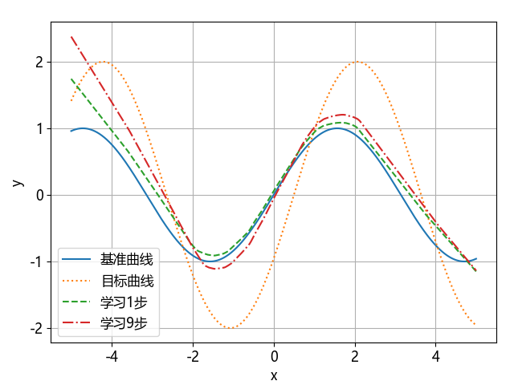
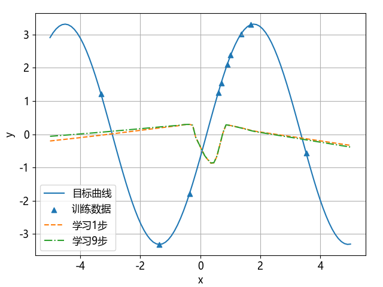
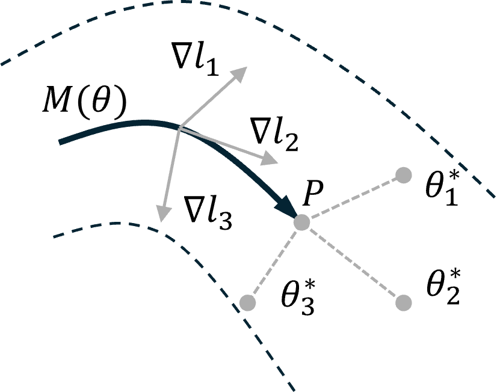
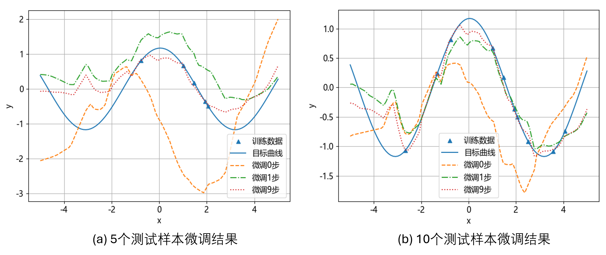

## 7.3 元学习

GPT-3 具有小样本学习的能力，而小样本学习的主要方法之一是元学习，所以我们先介绍什么是元学习。

在机器学习领域中一个重要的研究方向就是**元学习**（meta learning），也称为“学会学习”（learning to learn），它的目标是让机器学习系统学会高效地学习新任务，以解决传统模型对大量标注数据的依赖和训练时间过长的问题。元学习的核心思想是通过让模型从不同的任务中进行学习，最终具备快速适应新任务的能力。在传统的机器学习中，模型仅专注于某一具体任务，而元学习则旨在通过多任务学习来“学习”一个可以泛化于不同任务的学习策略。

### 7.3.1 单任务学习

图 7.3.1 基准正弦曲线的回归模型结果

图 7.3.2 在基准模型上做少量的迁移学习的结果

### 7.3.2 多任务学习

图 7.3.3 具有不同振幅和相位的正弦曲线

图 7.3.4 在多任务学习基础上的迁移学习的结果

### 7.3.3 元学习

图 7.3.5 元学习示意图

#### 1. 元训练

#### 2. 元测试

图 7.3.6 元测试结果中不同样本数量的影响
