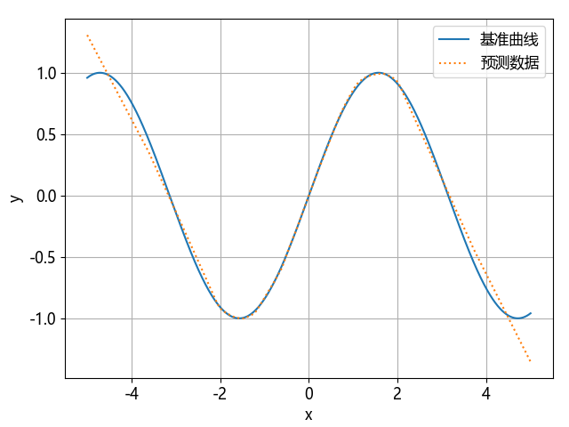
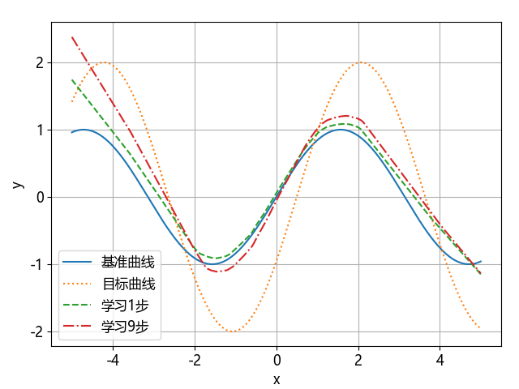
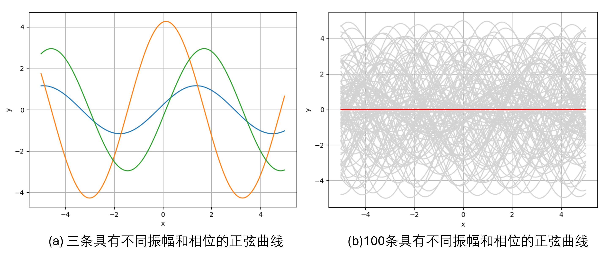
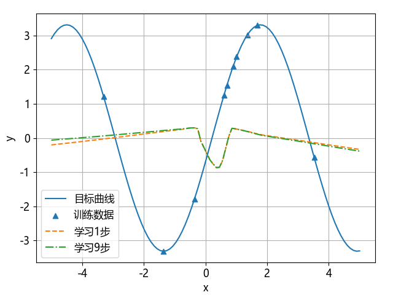
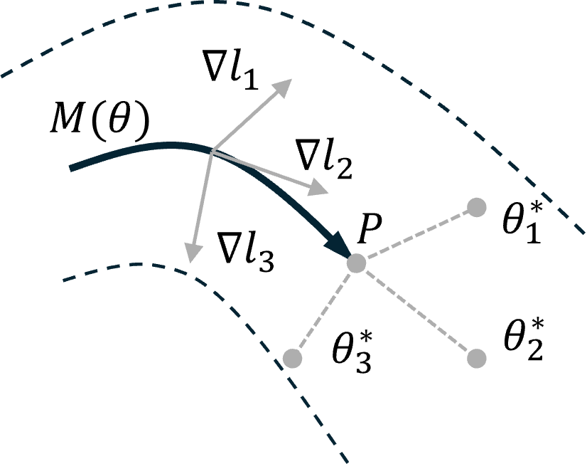

## 7.4 元学习

### 7.4.1 单任务学习

图 7.4.1 基准正弦曲线的回归模型结果

图 7.4.2 在基准模型上做少量的迁移学习的结果

### 7.4.2 多任务学习

图 7.4.3 具有不同振幅和相位的正弦曲线

图 7.4.4 在多任务学习基础上的迁移学习的结果

### 7.4.3 元学习

图 7.4.5 元学习示意图

图 7.4.6 元测试结果中不同样本数量的影响

