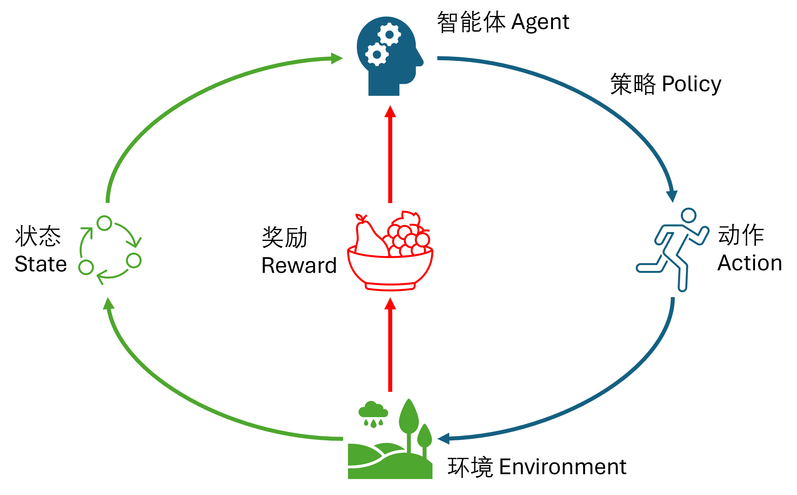
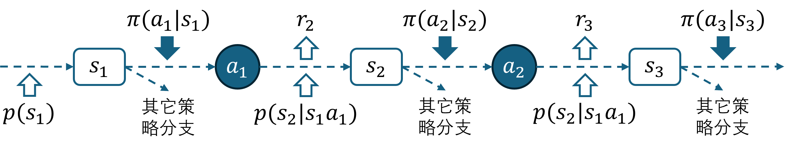
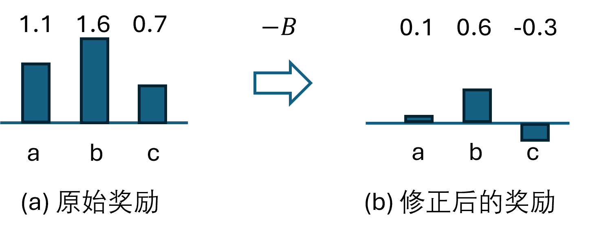
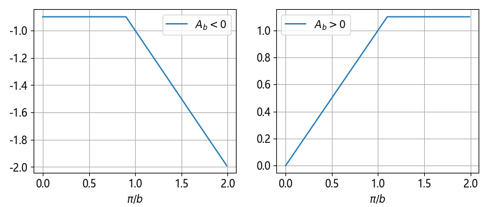

## 7.8 策略优化算法

### 7.8.1 关于策略的基本概念

图 7.8.1 强化学习模型

#### 1. 采样轨迹

图 7.8.2 关于策略的基本概念

#### 2. 同策略和异策略

#### 3. 价值函数

### 7.8.2 策略梯度

### 7.8.3 优势函数

图 7.8.3 原始奖励与减去基线 $B$ 的奖励

### 7.8.4 近端策略优化

#### 惩罚与剪裁

图 7.8.4 截断效果

