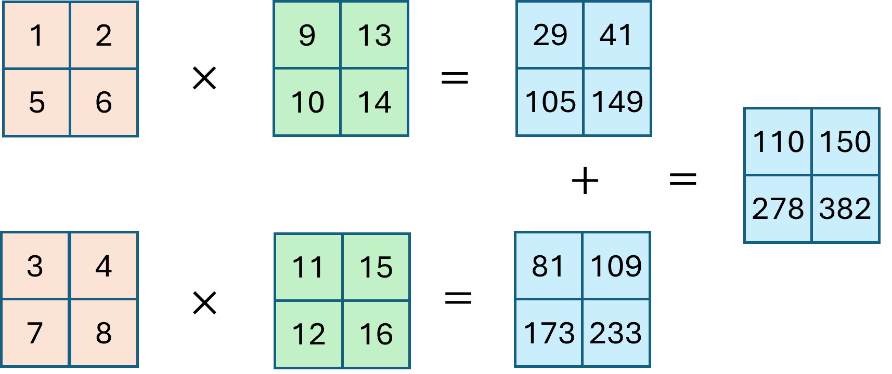

### 8.3 并行训练

### 8.3.1 数据并行

#### 1. 简单数据并行

图 8.3.1 数据并行工作流程

#### 2. 分布式数据并行

图 8.3.2 分布式数据并行的目标

图 8.3.3 分散求和阶段

图 8.3.4 聚集阶段

### 8.3.2 模型并行

#### 1. 模型分层

图 8.3.5 模型分层

#### 2. 流水线并行

图 8.3.6 对于模型并行的优化

#### 3. 张量并行

图 8.3.7 原始矩阵计算

图 8.3.8 张量列并行

图 8.3.9 张量行并行

### 8.3.3 混合并行

图 8.3.10 混合并行

#### 1. 零冗余优化器

#### 2. 全分布式状态并行

#### 3. 混合共享数据并行
