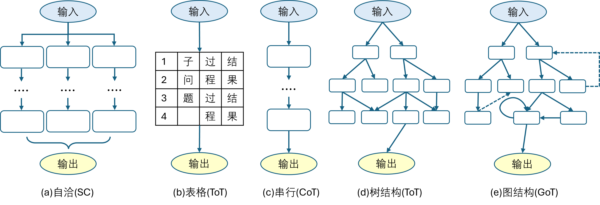

## 8.7 思维链

### 8.7.1 构建思维链提示

#### 1. 零样本提示

#### 2. 小样本提示

#### 3. 自动构建提示

### 8.7.2 构建思维链训练样本

#### 1. 算术推理

#### 2. 常识推理

#### 3. 符号推理

### 8.7.3 选择基础模型

### 8.7.4 训练逻辑推理模型

### 8.7.5 训练算术推理模型

### 8.7.6 思维链的多种模式

图 8.7.1 不同模式的思维链

### 8.7.7 对思维链推理的质疑与改进
