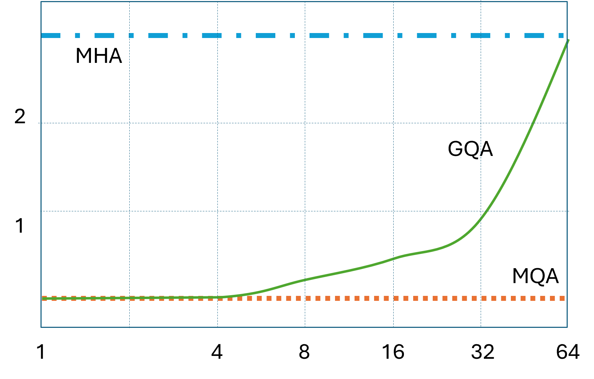

## 8.8 注意力机制的发展

### 8.8.1 稀疏注意力的形式

图 8.8.1 几种稀疏注意力的形式

#### 1. 全局注意力

#### 2. 带状注意力

#### 3. 扩张注意力

#### 4. 块状注意力

### 8.8.2 多头注意力机制及其变体

图 8.8.2 多头注意力机制及其变体结构

#### 1. 分组查询注意力

#### 2. 多查询注意力

图 8.8.3 多头注意力机制及其变体的性能
