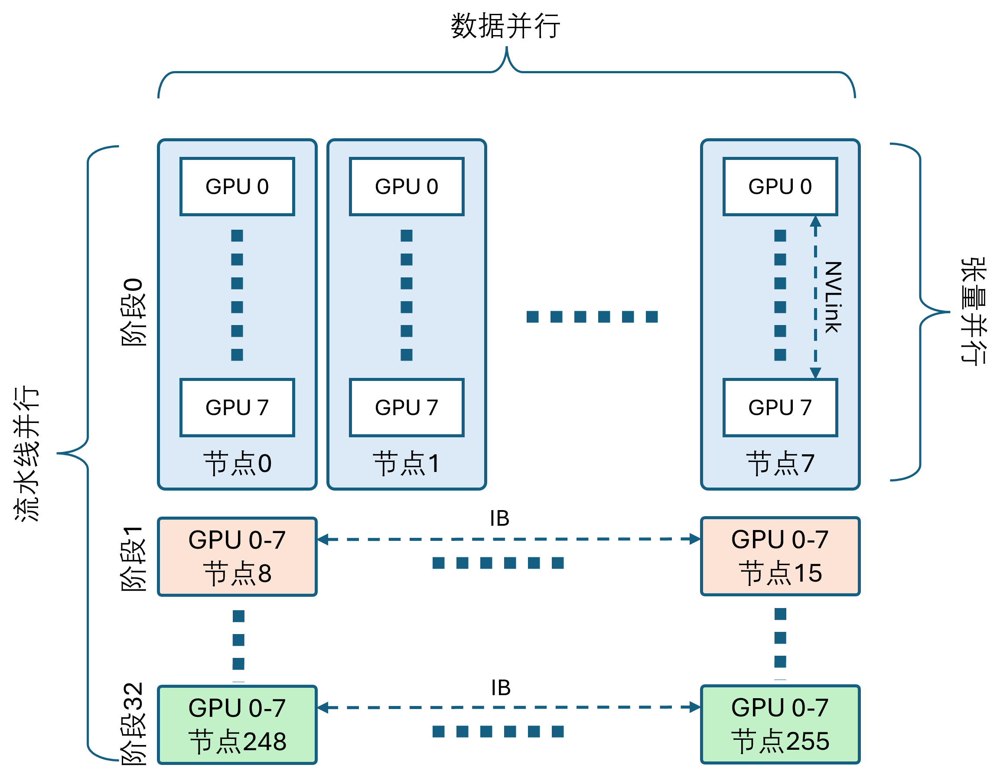
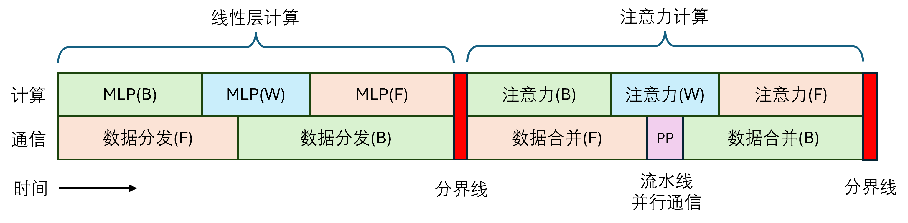
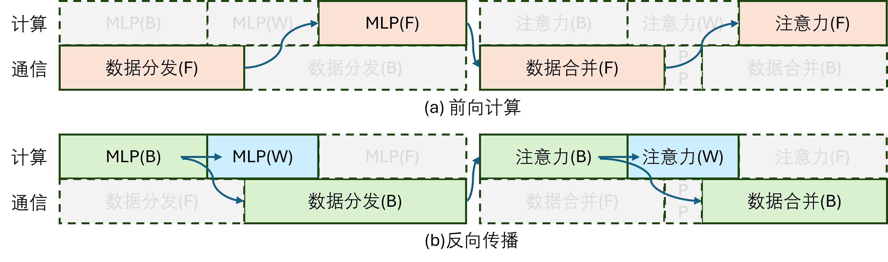
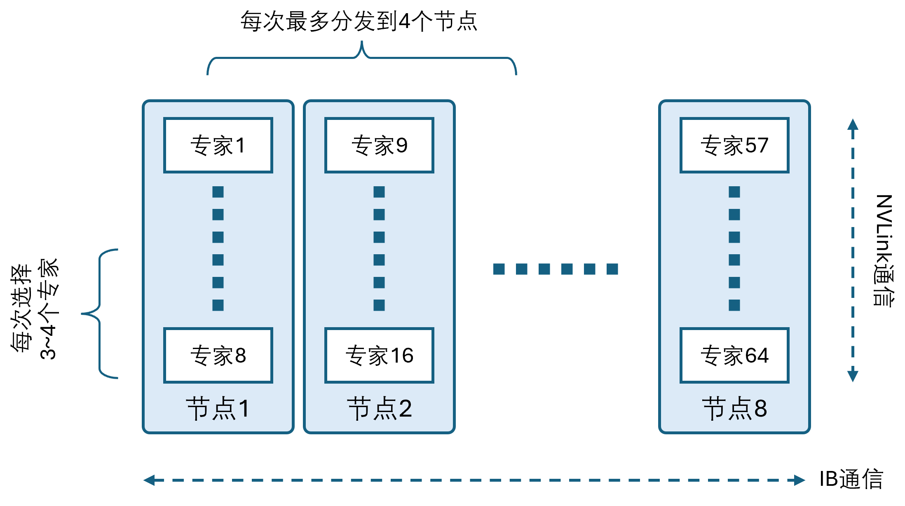
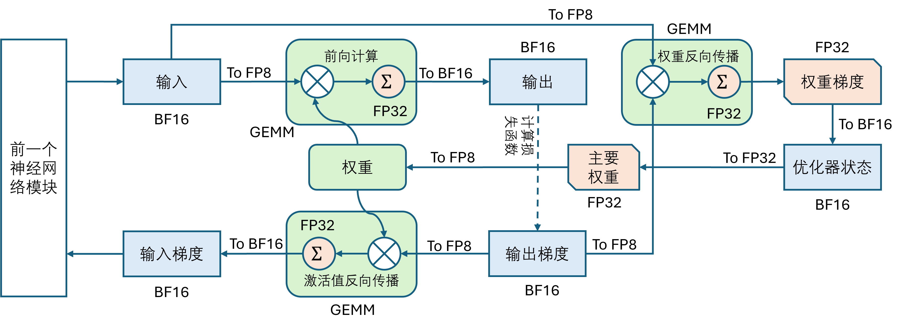

## 9.4 计算架构的探索

### 9.4.1 集群架构

图 9.4.1 计算集群架构

#### 1. DualPipe 技术与计算/通信协同优化

图 9.4.2 双向流水线并行

图 9.4.3 双向流水线并行分解

#### 2. 跨节点通信的高效实现

图 9.4.3 专家选择机制

#### 3. 极致的内存节省与最小开销

### 9.4.2 预训练

#### 1. 数据构建

#### 2. 模型参数

#### 3. 训练参数

#### 4. 混合精度 FP8 训练

图 9.4.3 FP8 混合精度训练框架

### 9.4.4 预测和部署

#### 1. 预填充阶段

#### 2. 解码阶段

