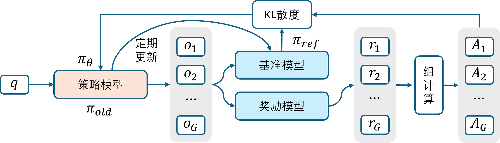
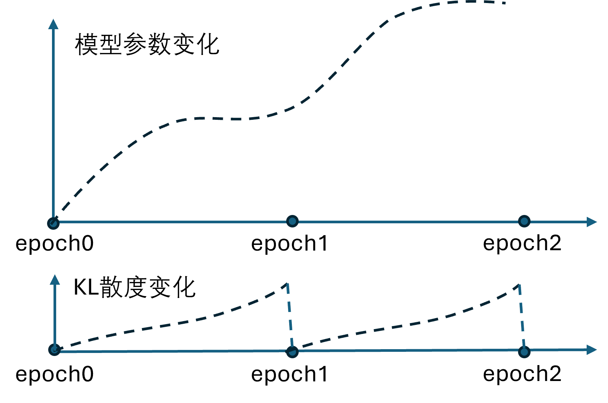
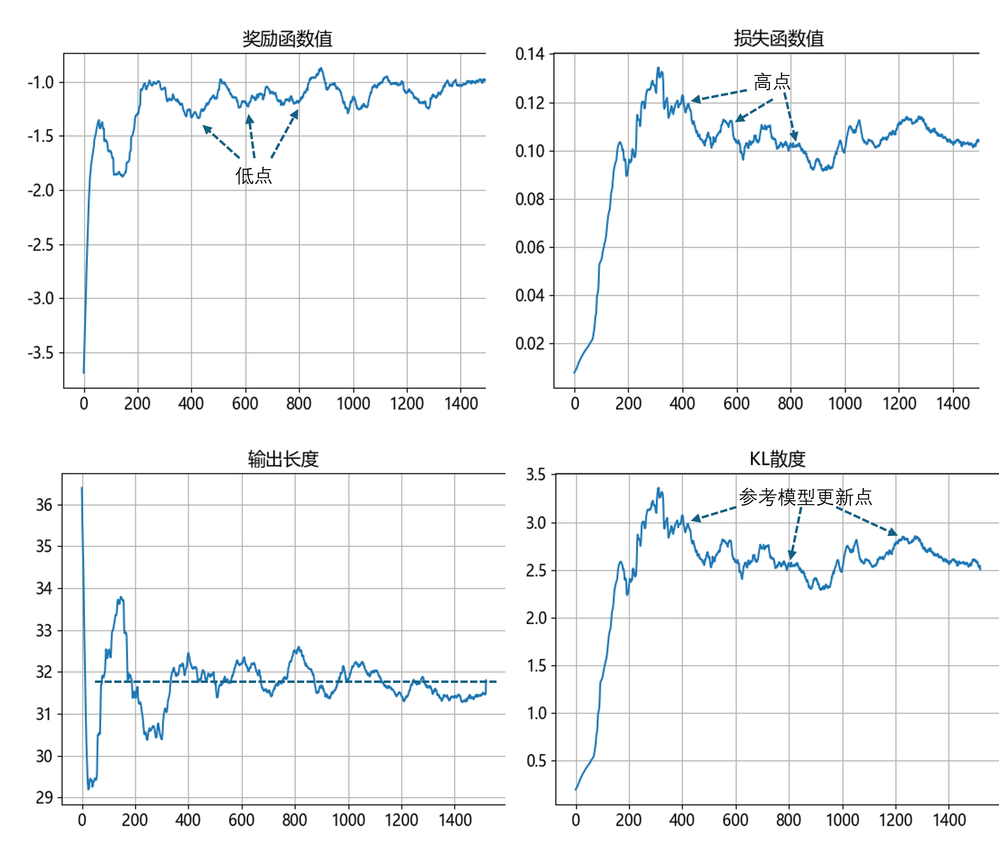

## 9.5 强化学习算法的探索

### 9.5.1 GRPO 算法

图 9.5.1 组相对策略优化训练过程

图 9.5.2 用 GRPO 训练模型时模型参数与 KL 散度的变化

### 9.5.2 基于规则的奖励模型

### 9.5.3 实例探索

#### 1. 选择数据集

#### 2. 选择基础模型

#### 3. 对话模板

#### 4. 奖励函数

#### 5. 训练模型

#### 6. 模型预测

### 9.5.3 调整奖励函数

### 9.5.4 再一次调整奖励函数

### 9.5.5 理解训练过程

图 9.5.3 训练过程中的各种指标变化图

