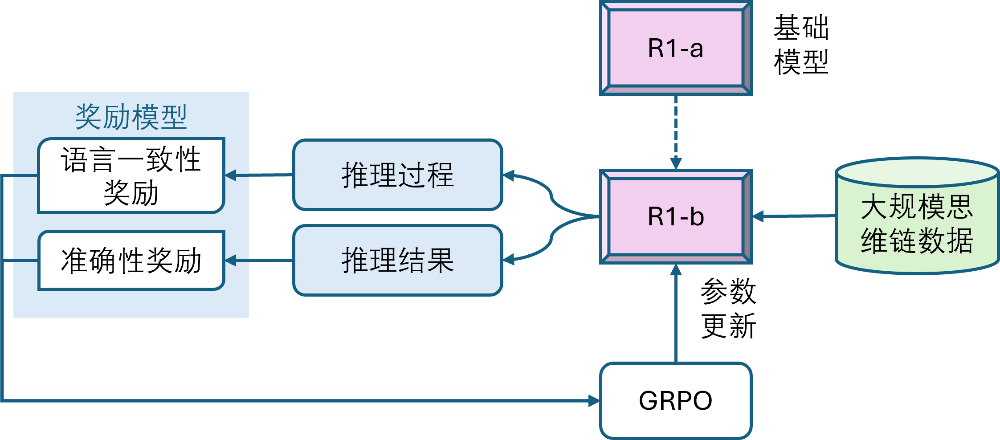
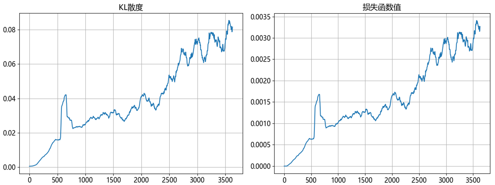
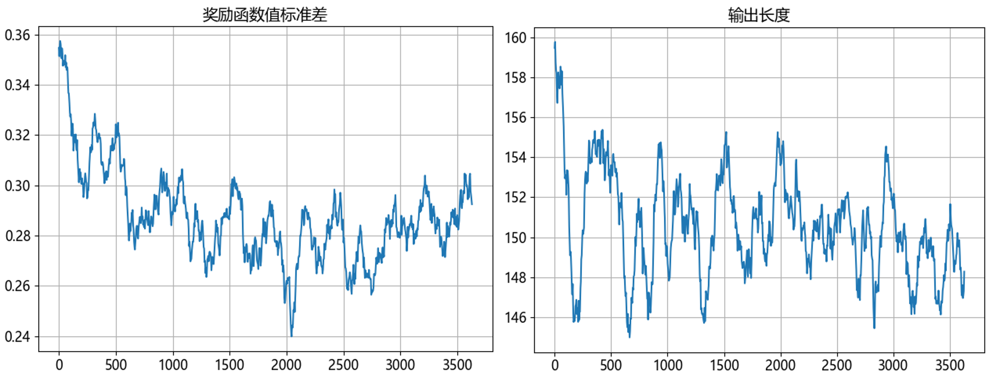
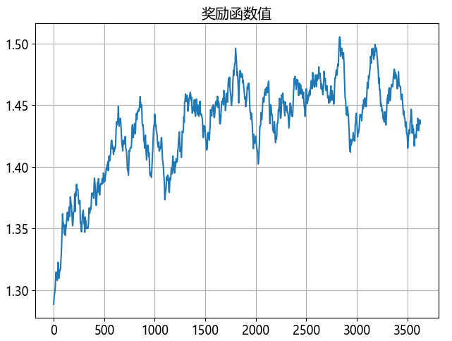

## 9.7 推理导向强化学习的探索

### 9.7.1 第二阶段：推理导向的强化学习

图 9.7.1 训练 DeepSeek-R1 第二阶段

### 9.7.2 实例探索

#### 1. 准备数据

#### 2. 定义奖励模型

#### 3. 准备模型和分词器

#### 4. 设置训练参数

#### 5. 使用加速器

#### 6. 关于输出格式

#### 7. 训练与测试

图 9.7.2 KL散度与损失函数值 

图 9.7.3 奖励函数标准差与模型输出长度

图 9.7.4 奖励函数

