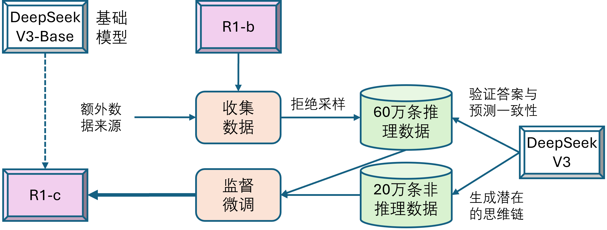
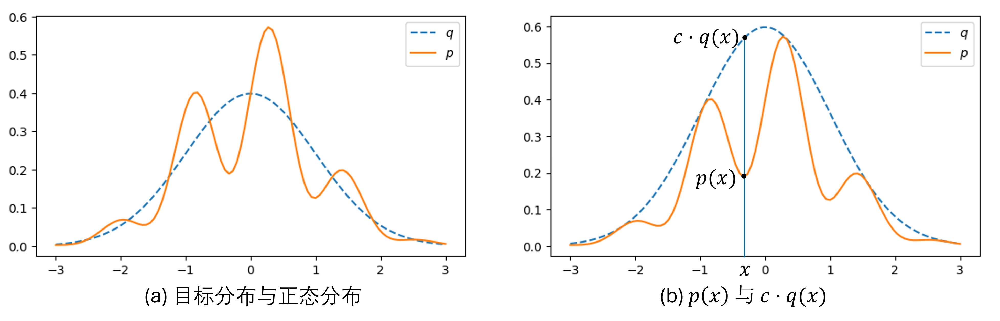
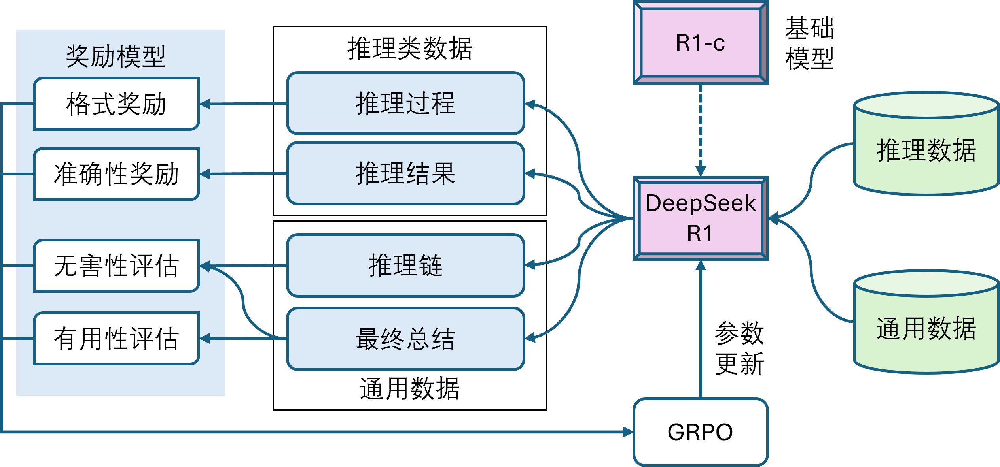
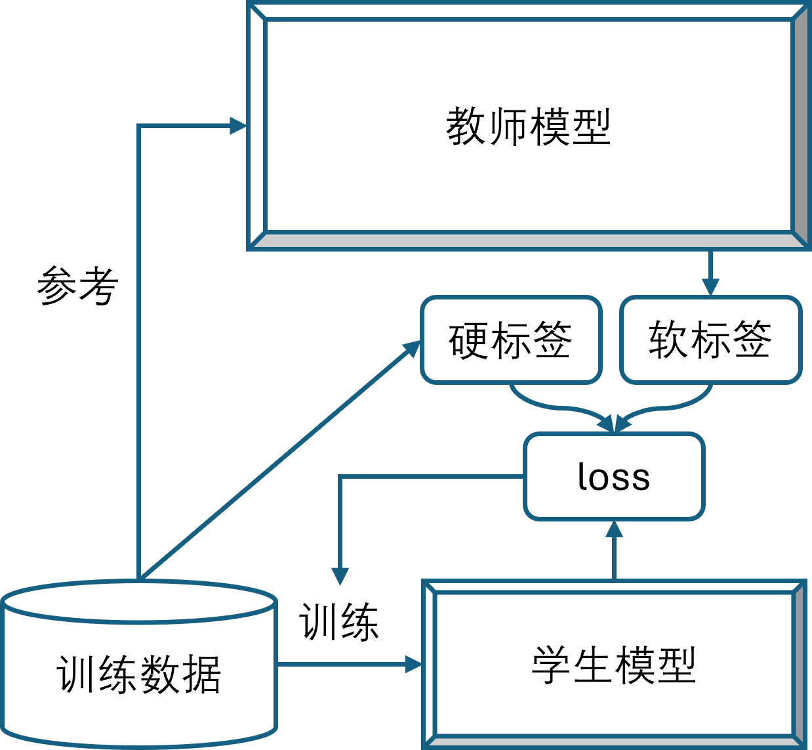

## 9.8 多阶段训练的探索

### 9.8.1 第三阶段：拒绝采样和监督微调

图 9.8.1 训练 DeepSeek-R1 第三阶段

#### 1. 使用拒绝采样收集推理数据

图 9.8.2 拒绝采样

#### 2. 收集非推理数据

### 9.8.2 第四阶段：全场景强化学习

图 9.8.3 训练 DeepSeek-R1 第四阶段

### 9.8.3 模型蒸馏

图 9.8.4 模型蒸馏

